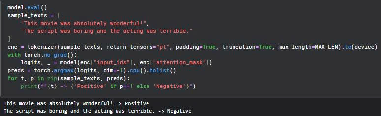
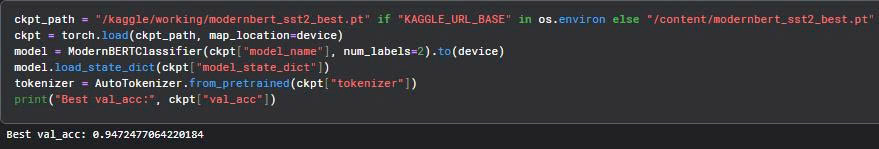
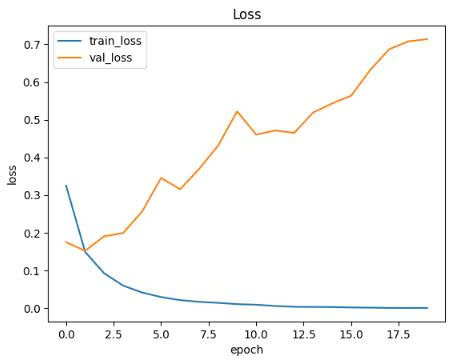
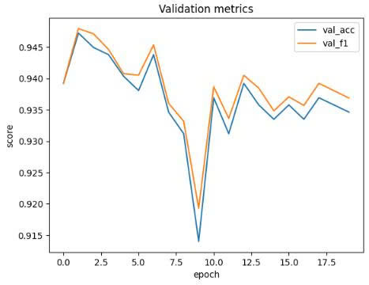
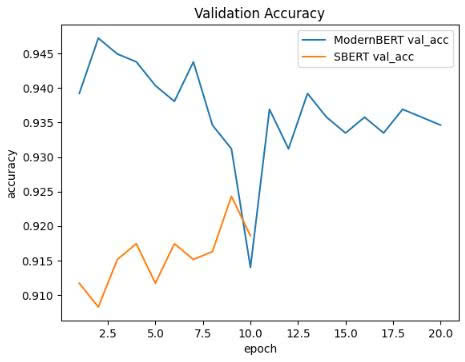
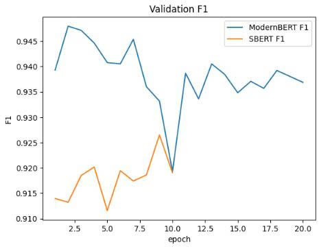
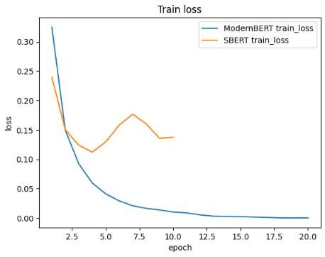

# ModernBERT_GLUE_SST-2

## 📌 Introduction  

This repository reproduces and extends experiments from the paper:  
[**"Smarter, Better, Faster, Longer: A Modern Bidirectional Encoder for Fast, Memory Efficient, and Long Context Finetuning and Inference" (Warner et al., 2024).**](https://arxiv.org/pdf/2412.13663)  

The project focuses on:  
- Analyzing the differences and improvements of **ModernBERT** compared to older encoders, especially **SBERT**.  
- Fine-tuning [**ModernBERT-base**](https://huggingface.co/answerdotai/ModernBERT-base) on the **GLUE/SST-2** benchmark to evaluate sentiment classification performance.  

---

## 🔍 Research Background   

### ModernBERT vs SBERT  

| Feature                  | SBERT (2019)                                | ModernBERT (2024) |
|--------------------------|----------------------------------------------|--------------------|
| Architecture             | Encoder-only (BERT base/large)              | Encoder-only (Deep & Narrow, GPU-optimized) |
| Max sequence length      | 512 tokens                                  | 8192 tokens |
| Positional Embedding     | Absolute                                    | Rotary Positional Embedding (RoPE) |
| Attention                | Full self-attention                         | Alternating Global-Local + FlashAttention |
| Tokenizer                | WordPiece (BERT original)                   | Modern BPE, supports text + code |
| Memory efficiency        | Moderate                                    | High (unpadded batching + FlashAttention) |
| Training data            | ~3.3B tokens                                | 2 trillion tokens (web, code, scientific) |
| GLUE (SST-2) performance | ~92–93%                                     | ~94–95% |

**Conclusion:** ModernBERT delivers a **state-of-the-art encoder**, outperforming SBERT and other previous encoders in both accuracy and efficiency.

---

## 🧪 Experiment 

Main notebook: **`modernbert-on-glue-sst-2.ipynb`**  
- Uses HuggingFace Transformers to load ModernBERT-base.  
- Fine-tunes on **SST-2** (Sentiment Analysis).  
- Evaluates accuracy on the validation set.
- Time for training ModernBERT: 7 hours.

### Training steps:  
1. Load GLUE/SST-2 dataset via `datasets`.  
2. Tokenize using the ModernBERT tokenizer.  
3. Fine-tune with HuggingFace `Trainer` using hyperparameters aligned with the paper:  
   - Learning Rate: `8e-5`  
   - Epochs: `20`  
   - Batch size: depends on GPU (see notebook).  
4. Save the fine-tuned model for inference.  

---

## 📌 Training Results (ModernBERT)

- **Dataset**: GLUE SST-2  
- Training time for **ModernBERT**: 7 hours 
- Training time for **SBERT**: 7 hours 

### 🔹 ModernBERT test for Sentiment Analysis

### 🔹 ModernBERT Best Validation Accuracy

### 🔹 ModernBERT Train_Loss Vs Validation Loss

### 🔹 ModernBERT Validation Metrics

---

## 📊 Model Comparison: **ModernBERT** vs **SBERT**

The following figures illustrate the comparative performance between **ModernBERT** and **SBERT** on the validation set. I can't train the SBERT model for 20 epochs, because it takes too much time.

### 🔹 Validation Accuracy

**ModernBERT**: consistently higher than SBERT (ranging around 0.935–0.945).

**SBERT**: significantly lower (ranging around 0.91–0.925).

👉 Conclusion: **ModernBERT** predicts more accurately overall, demonstrating better generalization ability than **SBERT**.

### 🔹 Validation F1 Score

**ModernBERT**: consistently higher (0.935–0.945).

**SBERT**: significantly lower (0.91–0.92).

👉 Conclusion: **ModernBERT** is not only more accurate but also balances Precision and Recall better. This is very important in binary classification problems with mislabeled data.

### 🔹 Train Loss

**ModernBERT**: loss decreases sharply and quickly approaches 0 → showing that the model learns very well and optimizes the weights effectively.

**SBERT**: loss decreases slowly, fluctuates, and does not approach 0 → the model has difficulty reducing the error.

👉 Conclusion: **ModernBERT** has better learning ability and optimizes faster than **SBERT**.

---

## In Conclusion  

- **ModernBERT** outperforms **SBERT** in all three criteria: train loss, validation accuracy, and validation F1.

- **ModernBERT** learns faster (loss is reduced), is more accurate (val acc is higher), and generalizes better (F1 is higher).

- **SBERT** is limited in optimizing loss and achieving the same level of generalization as **ModernBERT**.

👉 Therefore, in the context of the GLUE SST-2 problem in particular and other NLP problems in general, **ModernBERT** is a much better choice than **SBERT**.  
 

